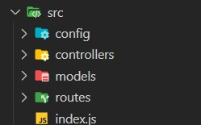
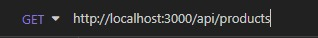
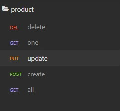
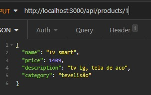

# Api rest com Node.js, Mysql e Sequelize

- Video pego para o aprendizado do projeto - [**Link**](https://www.youtube.com/watch?v=u5q8wJQLWzI)

- Ferramentas usados :

  - Insomnia - 

  - Visual studio Code - 

  - MySql Workbench - Testes Bancos - 

## Começando o projeto

- Localizando um diretório apropriado, abrimos o visual studio code e abrimos o terminal. Com ele aberto, usamos os seguintes comandos :

  - `npm init -y` = Instala o **package.json** do projeto, e o `-y` do comando serve para não fazer perguntas sobre a criação do arquivo.

  - Seguindo o projeto, utiliza-se no terminal `npm i sequelize express mysql`, ele instala o sequelize, biblioteca que ajuda na conexão do banco de dados, o express, biblioteca que auxilia na conexão HTTP e outros afins, e por fim, a biblioteca do mysql, o que pode ser trocado por outro banco que vc utlizará no projeto.

  - Para o desenvolvimento, e para mais produtividade, é utilizado a biblioteca Nodemon, que é usada quando salvamos o código na IDE, pois não precisamos parar o servidor local para vermos o projeto atualizado,o que acontece se somente executar com o node. o comando é o `npm i nodemon -D`. O `-D` serve para salvar no package.json como uma devDepedencie.

- Depois dos comandos já executados e bem sucedidos, é feita uma pequena mudança no package.json, para o maior aproveitamento na codação. é colocado nos scripts do .json _( o index.js é criado mais tarde)_

```json
"scripts": {
  "start": "nodemon src/index.js"
},
```

- Agora, são criadas os **diretórios** e os **arquivos**.Primeiramente, criamos a pasta `src`, que será o pai dos demais códigos. exatamente assim


- Dentro dessa pasta, crie o arquivo com o nome de `index.js` , arquivo que será executado pelo nodemon com o comando que colocamos

- depois do fato feito, criaremos os seguintes diretórios :

  - `config` = pasta da conexão do banco de dados

  - `controllers` = pasta onde armazena os códigos do sequelize,para fazermos o **CRUD**.

  - `models` = diretório onde terá a criação da tabela do banco de dados.

  - `routes` = por ultimo, pasta que armazena as rotas utilizadas, da conexão do banco por JSON.

- Deve ficar assim :



---

## Codando

- Depois do processo de criação de arquivo e pastas, dentro do `index.js`, vamos colocar o seguinte código :

```js
//importa o express, biblioteca instalada
const express = require('express');
//chama ele e armazena ele na variável app
const app = express();
//o app vai ler json
app.use(express.json());

//vai iniciar na porta 3000 e esse evento vai logar no console uma mensagem.
app.listen(3000, () => console.log('Servidor iniciado na porta 3000 :)'));
```

- Agora, dentro na pasta config, crie um arquivo chamado `database.js`, e escreva :

```js
//importa o Sequelize
const Sequelize = require('sequelize');
//inicia o sequelize, criando a conexão
const sequelize = new Sequelize(
  'Nome-do-banco',
  'usuario-do-banco',
  'senha-do-banco',
  {
    host: 'localhost-ou-ip',
    dialect: 'banco-usado', //exemplo,mysql
  }
);
//exporta a conexão para outros arquivos
module.exports = sequelize;
```

- Com a conexão já criada, insira apenas mais 2 coisas no `index.js` :

```js
//pega as configurações do database.js e insere na variavel sequelize, ou seja, importou a variavel
//OBS : não é necessario colocar a extensão do arquivo ( database.js)
const sequelize = require('./config/database');

//. . . .

//resumidamente, vai printar no console a mensagem caso a conexão for sucedida
sequelize
  .sync()
  .then(() => console.log('banco de dados conectado com sucesso !!'));
```

- Depois de atualizado, vamos criar o `productModel.js` dentro da pasta `models` . coloque assim :

```js
//importa o que vai ser utilizado do sequelize
const { Model, DataTypes } = require('sequelize');
//importa a conexão
const sequelize = require('../config/database');

//cria uma classe Produto, que herda de Model
class Product extends Model {}
//inicia o produto, criando as linhas da tabela
Product.init(
  {
    //linha nome, sendo string
    name: {
      type: DataTypes.STRING,
    },
    //linha preco, sendo float
    price: {
      type: DataTypes.DECIMAL,
    },
    //linha descrição, sendo string
    description: {
      type: DataTypes.STRING,
    },
    //linha categoria, sendo string
    category: {
      type: DataTypes.STRING,
    },
  },
  {
    //com o que vai ocorrer a conexão
    sequelize,
    //nome do modelo
    modelName: 'product', //nome da tabela
    timestamps: false, //função quando verdadeira criara na tabela as coluna createdAt e updateAt
  }
);
//e exporta a classe
module.exports = Product;
```

- Quando criado o modelo da tabela, devemos criar, dentro da tabela `controller`, criaremos o `productController` :

```js
//importa a tabela
const Product = require('../models/productModel');

//e vai exportar essa função
module.exports = {
  //uma função assincrona, que espera a chegada de dados
  async all(request, response) {
    //vai tentar isso -
    try {
      //vai guardar na variavel o tudo o que encotrar na tabela Product
      const products = await Product.findAll();
      //vai dar status 200( ok ) e mostra o resultado em Json
      response.status(200).json(products);
    } catch (error) {
      //se dar erro -
      //status 400( bad request)
      response.status(400).send(error);
    }
  },
};
```

- Em seguida, crie mais uma arquivo, entretanto no diretório `routes`. o arquivo será `index.routes.js` e ele receberá as seguintes frases :

```js
//chama o express
const express = require('express');
//pega as funções do productController
const productController = require('../controlers/productController');
//pega a função das rotas
const router = express.Router();
//quando for a raiz do projeto na URL, ele executará a função get( Read ), que pega a função all do productController
router.route('/').get(productController.all);

//exporta
module.exports;
```

- Antes de testar no Insomnia, colocaremos mais 2 linhas no `index.js`:

  - ```js
    //.....
    //chama as rotas
    const Routes = require('./routes/index.routes');
    //.....
    app.use('/api/products', Routes);
    ```

  - Quando acessar o `/api/product` , ele chamará a função routes, que liga ai em cima

- Agora, se quiser, acesse o insomnia, coloque o localhost e tente ver o que tem na tabela _(OBS: deve retornar um "[ ]", pois não adicionamos nada pelo node)_



- Se deu tudo certo, OK. Adicionaremos as outras funções do crud, tudo no `controllers` _(dentro do module exports)_:

```js
//vai procurar apenas um
async one(request, response) {
    try {
      //pega o id da URL
      const id = request.params.id;
      //faz a procura no banco
      const product = await Product.findOne({ where: { id } });

      if (!product) {
        //se o product der False, ele enviará um product not found
        return response.status(400).json('Product not found');
      }
      //se não cair no if, ele ira printar o produto com o id
      response.status(200).json(product);
    } catch (error) {
      response.status(400).send(error);
    }
  },
  //vai criar um item
  async create(request, response) {
    try {
      //vai pegar os items citados no corpo do json,e vai criar o item na tabela
      await Product.create(request.body);
      response.status(200).json('product inserted');
    } catch (error) {
      //se os nomes não se coincidirem, printará o erro
      response.status(400).send(error);
    }
  },

  //vai setar outro valor, vai atualizar
  async update(request, response) {
    try {
      //vai pegar as info do corpo, e ira pegar o id da URL
      const { name, price, description, category } = request.body;
      const id = request.params.id;

      //vai encontrar o item
      const product = await Product.findOne({ where: { id } });

      if (!product) {
        //se der erro...
        return response.status(400).json('Product not Found!');
      }
      //vai salvar nas variaveis
      product.name = name;
      product.price = price;
      product.description = description;
      product.category = category;
      //e vai salvar
      await product.save();
      response.status(201).json('Product Updated!!');
    } catch (error) {
      //erro
      response.status(400).send(error);
    }
  },
  //vai deletar um item
  async delete(request, response) {
    try {
      //pega o id da URL
      const id = request.params.id;
      //acha e deleta
      const product = await Product.destroy({ where: { id } });

      if (!product) {
        //se não encontrar
        return response.status(400).json('Product Not Found!!');
      }

      response.status(200).json('Product removed');
    } catch (error) {
      response.status(400).send(error);
    }
  },
```

- E por ultimo, vamos colocar no routes, para funcionar o código escrito

```js
//OBS : o .get() já estava ai
//se for a URL raiz
router.route('/').get(productController.all).post(productController.create);
router //quando o a URL for id, dependendo do que quer vai executar as funções
  .route('/:id')
  .get(productController.one)
  .put(productController.update)
  .delete(productController.delete);
```

| Separação                             | o que RequerId                                          |
| ------------------------------------- | ------------------------------------------------------- |
|  |  |

---

### FINALY HAPPY
